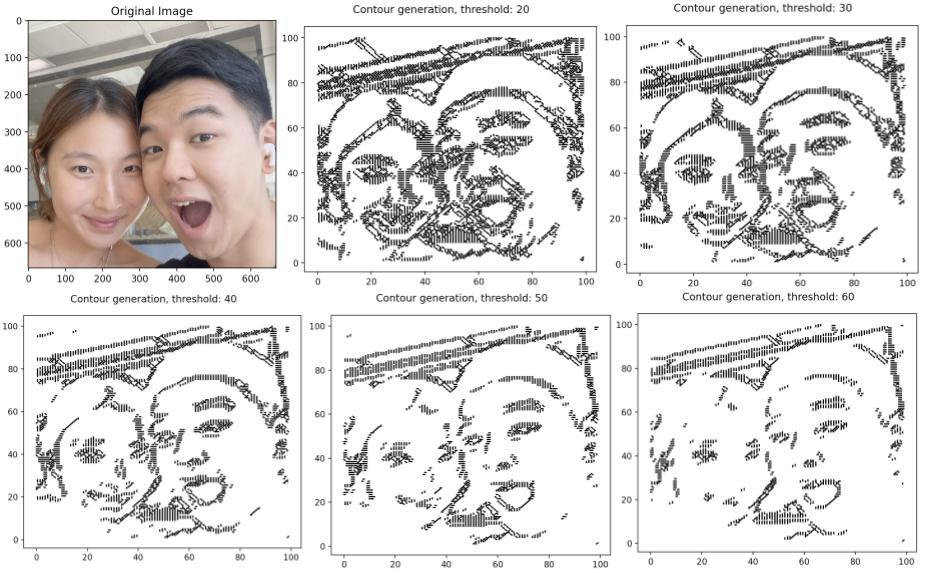

# Image Contour Generator

This implements a twist on the standard procedure of contour generation using marching squares. The algorithm generates contours of images based on differences between neighboring tiles, as opposed to a universal value threshold. 

--

## Algorithm

Standard implementations of contour generation using marching squares uses a universal threshold to determine wheter a tile is "inside" or "outside" of the contour. While this approach is appropriate for generating contours of implicit expressions, generating contours (namely, salient contours) is difficult with this approach, since contours from real images are not defined by global thresholds, but rather, local changes in color. 
Thus, I implemented this contour generator that determines borders between tiles based on whether two corners on a "square" have a differnece in color intensity greater than a relative threshold value. 
As such, the lookup-table contour lines greatly differ from standard implementations of the marching squares algorithm.

--

## Image Processing

To make the algorithm run in a reasonable amount of time, there is a resizing option that allows the user to resize the image into a lower resolution. Next, the image is turned into a black-and-white image with increased contrast. This makes the algorithm more robust to noise, and makes it easier to identify where contours should be. 